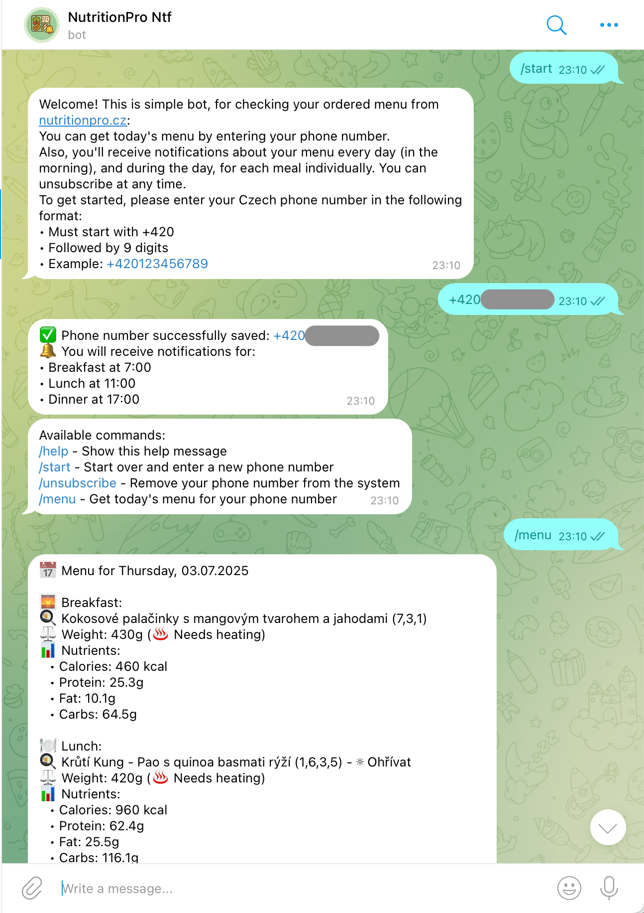
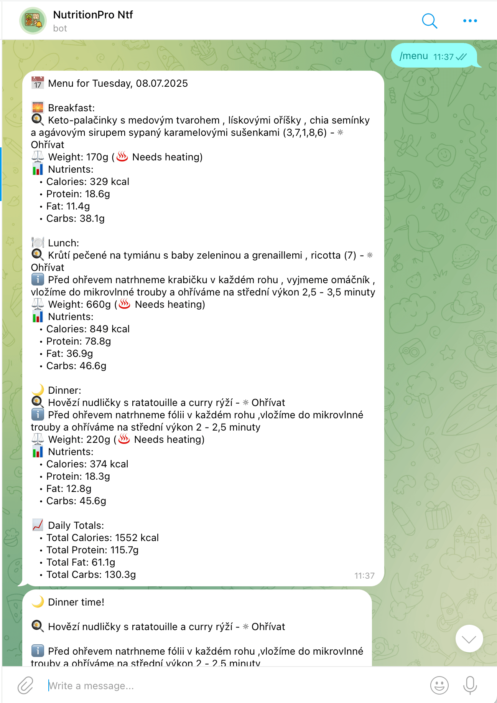
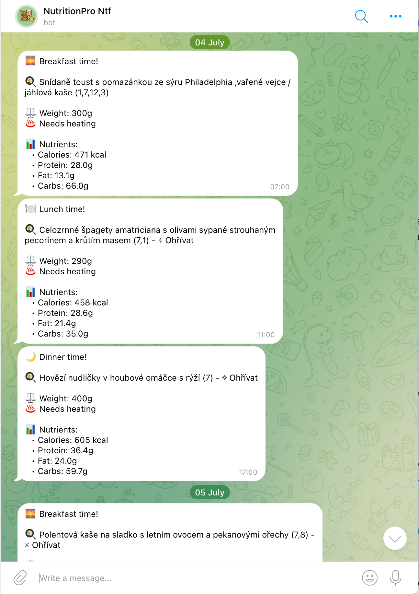

# NutritionPro Telegram Bot 🍽️ 🔔

A Telegram bot that helps users track their [NutritionPro](https://nutritionpro.cz/) meal deliveries and receive timely
notifications about their daily meals/courses.

## Features

- 🔔 **Automated Meal Notifications**
    - Breakfast notification at 7:00
    - Lunch notification at 11:00
    - Dinner notification at 17:00

- 📋 **Menu Information**
    - View today's complete menu
    - Detailed meal information including:
        - Meal title and description
        - Weight and heating requirements
        - Nutritional values (calories, protein, fat, carbs)

- 👤 **User Management**
    - Phone number registration — subscription to notifications
    - Unsubscription process

## Commands

- `/start` - Initialize or change the registration of your phone number
- `/menu` - Get today's menu for your registered phone number
- `/unsubscribe` - Remove your phone number from bot and disable notifications
- `/help` - Display available commands and usage information

## Requirements

- Go 1.24
- Telegram Bot Token
- Access to NutritionPro API (internet and account credentials)
- No need for a public server; can run locally or on a private server as the bot is pull-based

## Limitations

- Supports only Czech phone numbers (+420 format)
- Fixed notification times (not configurable per user)
- One phone number per Telegram chat ID
- Phone numbers are stored in memory (non-persistent)
- Support for three meals per day (breakfast, lunch, dinner) — no support for snacks or additional meals

## Technical Details

The bot integrates with:

- NutritionPro API for meal information
- Telegram Bot API for user interaction
- Uses cron scheduling for notifications

## Usage Example

1. Start the bot with `/start`
2. Enter your phone number in the format: `+420123456789`
3. Receive automatic notifications for each meal
4. Use `/menu` to check your daily menu anytime

# Screenshots

    
    
    

